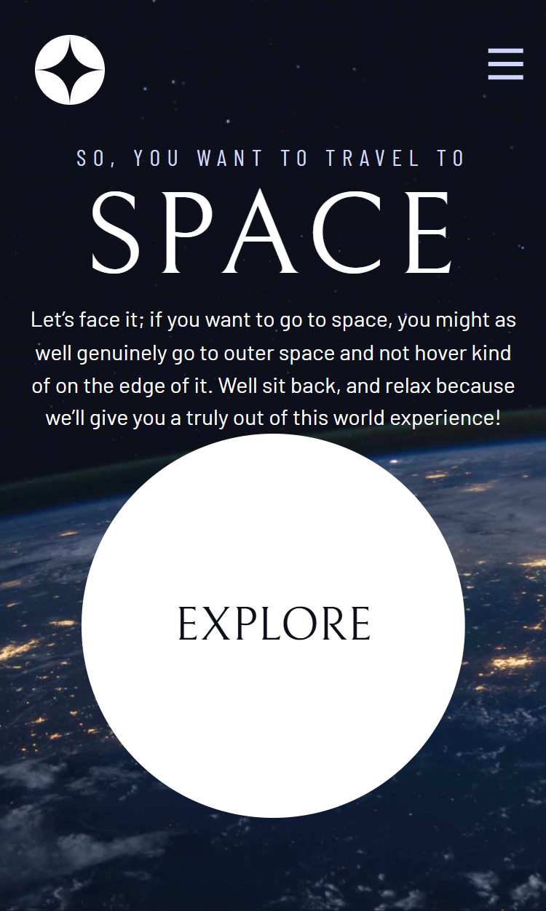
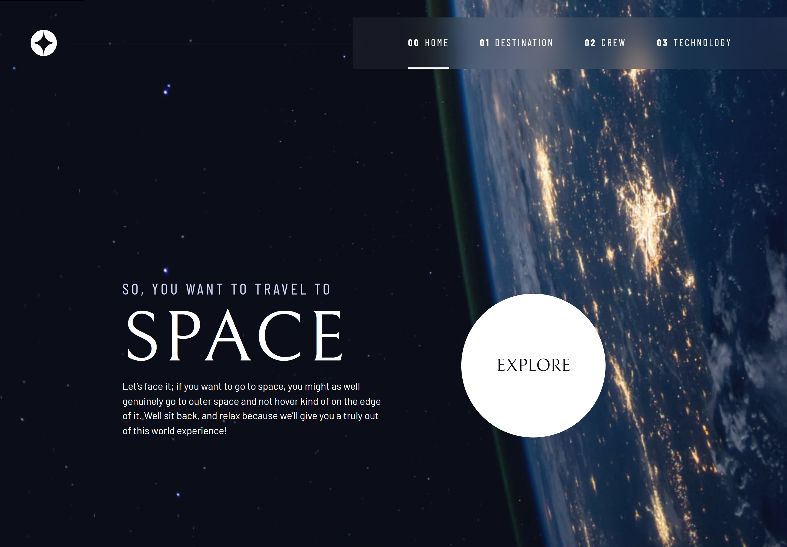

# Frontend Mentor - Space tourism website solution

This is a solution to the [Space tourism website challenge on Frontend Mentor](https://www.frontendmentor.io/challenges/space-tourism-multipage-website-gRWj1URZ3). Frontend Mentor challenges help you improve your coding skills by building realistic projects.

## Table of contents

- [Overview](#overview)
  - [The challenge](#the-challenge)
  - [Screenshot](#screenshot)
  - [Links](#links)
- [My process](#my-process)
  - [Built with](#built-with)
  - [What I learned](#what-i-learned)
  - [Continued development](#continued-development)
  - [Useful resources](#useful-resources)
- [Author](#author)

## Overview

A project built by creating a Design System with CSS.

### The challenge

Users should be able to:

- View the optimal layout for each of the website's pages depending on their device's screen size
- See hover states for all interactive elements on the page
- View each page and be able to toggle between the tabs to see new information

### Screenshot

### Links

- Solution URL: [solution](https://github.com/remainhumble/Space-tourism-multi-page-website)
- Live Site URL: [live site](https://remainhumble.github.io/Space-tourism-multi-page-website/)

## My process

not perfectly built.

### Built with

- Semantic HTML5 markup
- CSS custom properties
- Flexbox
- CSS Grid
- Mobile-first workflow

### What I learned

Learned how to create a design system while building a Space Travel Website.

### Continued development

Throughout this project, I deepened my understanding of accessible UI design and responsive layouts. I learned how to use ARIA attributes to improve screen reader support for interactive elements, and how to manage focus states for better keyboard navigation.
I also practiced using CSS custom properties for theming and maintaining consistent styles.

### Useful resources

- [Create a Design System with CSS - Web Development Course](https://www.youtube.com/watch?v=lRaL-8qZ0mM) - Learn how to create your own design system while building a Space Travel Website with CSS guru Kevin Powell. You can also follow the interactive Scrimba version of this course by clicking here: https://scrimba.com/learn/spacetravel

## Author

- Frontend Mentor - [@remainhumble](https://www.frontendmentor.io/profile/remainhumble)
- X(formerly Twitter) - [@thiflan120699](https://x.com/thiflan120699)
